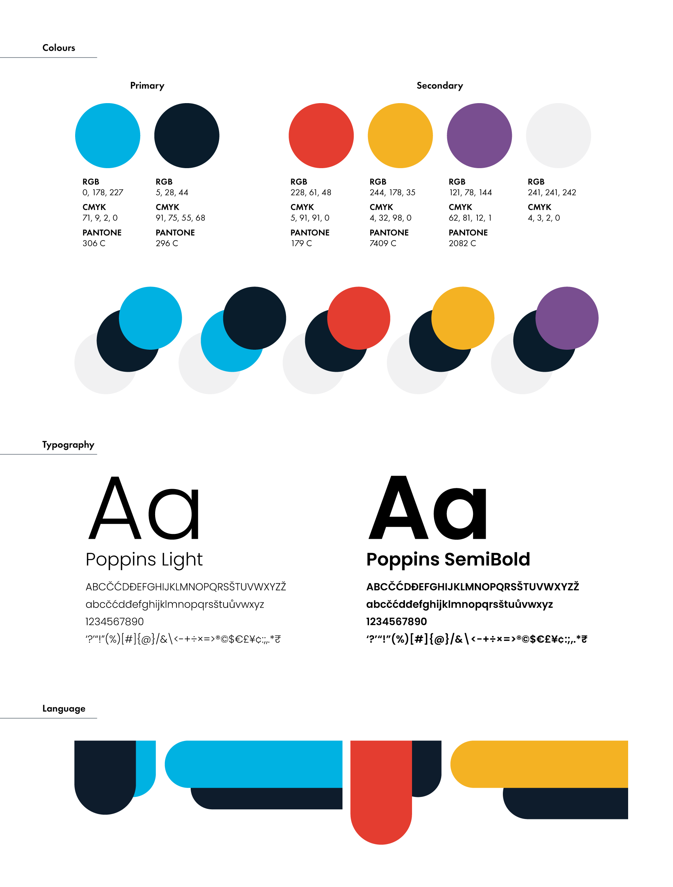
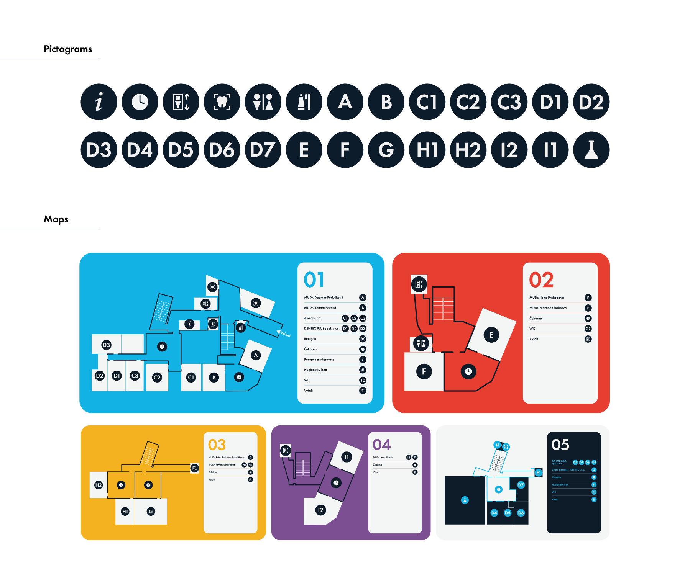
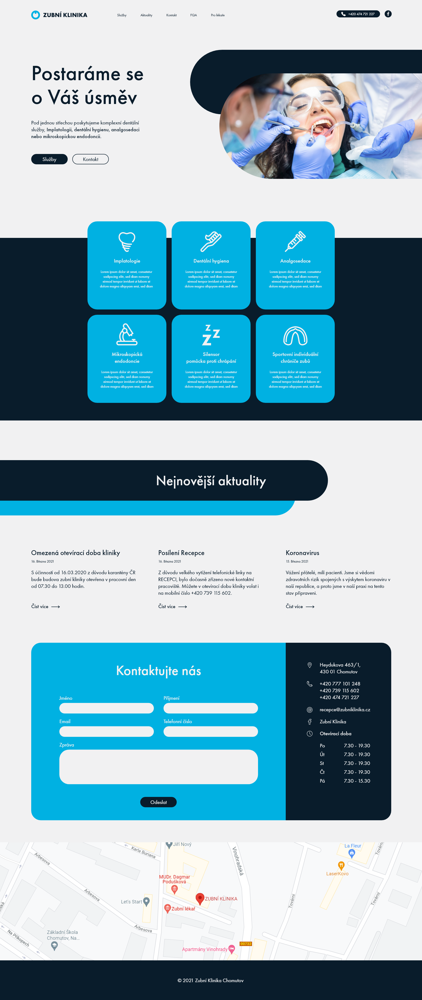

# Zubní klinika

## About and problem

Zubní klinika is a dentist clinic based in Chomutov. They provide complex dental services under one roof. They needed to expand but the building was not providing enough space. They decided to buy other two buildings and connect them. The problem is that these buildings have very different layouts and styles. For visitors became quite difficult to navigate through the building and they were getting lost. My task was to unify the visual identity, create orientation systems of the building, and design a new website. 

## Visual Identity

Firstly I needed to design a visual identity that would unify and be applied to all the materials. I cleaned their logo and created a logo manual which they did not have. Then choose the main color palette. That consists of blue, dark blue, and white. Then designed a visual language. That consists of two thick lines. Those symbolize tongue or opened mouth.

Since the building has three floors levels but the elevator has five buttons, it did not make sense to split the building by floors. I decided to split the building into five separated parts and distinguished them with a secondary color palette.

This visual identity was then applied ti posters, office hours plates and other materials.

## Orientation system

The main challenge was to design the orientation systems. I started with maps which needed to be a simplified floor plan of the building. With that, I needed to design pictograms and captions.

## Website

Lastly, I was asked to redesign their website. The current one does not communicate what they do. I applied the visual identity I have designed and made the UI/UX more intuitive.

